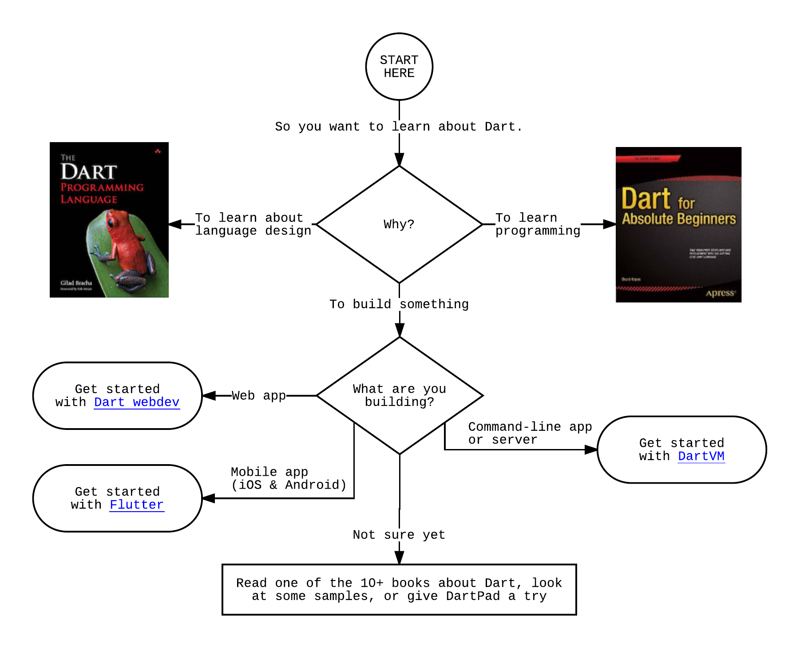

使用下面内嵌的 DartPad 来玩转 Dart，体验其语言魅力和核心 API。
熟悉其语言特性是快速入门 [DartPad](/tools/dartpad) 的一个好方法。
您也可以在<a href="http://dartpad.dartlang.org" target="_blank">新窗口中打开 DartPad</a>.

<iframe
src="{{site.custom.dartpad.embed-dart-prefix}}?horizontalRatio=70&verticalRatio=65"
    width="100%"
    height="310px"
    style="border: 1px solid #ccc;">
</iframe>

请注意，DartPad 仅支持几个核心库。
如果您想要使用其他库，
例如 dart:io 或者包中的库，
您需要 [安装](/install) SDK。

  <h2>准备好了吗？</h2>
  

    本网站（<a href="/">www.dartlang.org</a>）包含了关于 Dart 技术的基本内容：
  

  <ul>
    <li><a href="/guides/language">语言</a></li>
    <li><a href="/guides/libraries">核心库</a></li>
  </ul>
  

    但当您有一个使用案例时，您会找哪里？
  

| | | **使用案例** | **入门** |
| <i class="fa fa-code" aria-hidden="true"></i> | **Web** | 创建一个可运行在任何现代浏览器中的应用 | <a href="{{site.webdev}}/guides/get-started" class="btn btn-primary no-automatic-external">Dart webdev</a> |
| <i class="fa fa-android" aria-hidden="true"></i> <i class="fa fa-apple" aria-hidden="true"></i> | **Mobile** | 创建一个使用了同一份代码的 iOS 和 Android 应用 | <a href="https://flutter.io/getting-started/" class="btn btn-primary no-automatic-external">Flutter</a> |
| <i class="fa fa-terminal" aria-hidden="true"></i> | **Server** | 创建一个命令行或服务器应用 | <a href="/tutorials/dart-vm/get-started" class="btn btn-primary">Dart VM</a> |
{:.get-started-table}


*如果您有自己喜欢的 IDE，其可能已经有一个 Dart 插件，
有关如何配置推荐的 IDE 详细信息，请参见链接。
对于通用 IDE 的建议，请见 [工具](/tools).


## 指引图


The original Lucid Chart is here:
https://www.lucidchart.com/documents/edit/0f170001-d5f4-4b17-8cdc-72d5575f2e78?shared=true&#
Created by filiph, the Lucid app is available to Googlers in mystuff.


<object class="get-started-flowchart" type="image/svg+xml" data="images/get-started-flowchart.svg">
  
</object>

## 图书

如果您正在寻找一个更加快速学习 Dart 的方法，我们推荐您选择一本 [Dart 图书](/resources/books)。

## 示例

检出 Dart [示例](/samples).

## 获取帮助

Dart 有许多社区和平台，您可以在上面提问或者回答 Dart 相关的问题。有关详细信息，请参阅[社区与支持](/community).

